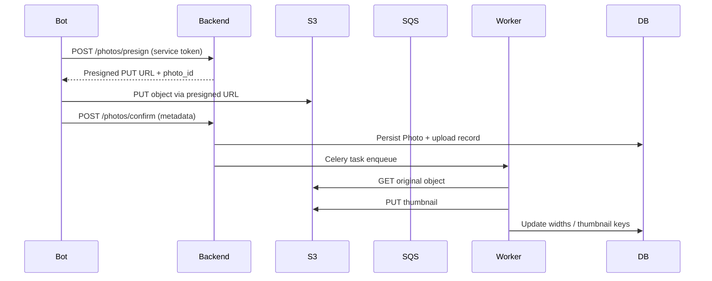

# S3-backed Media Pipeline

## Overview

The Telegram complaint bot now uses a presigned-upload pipeline backed by AWS S3, Celery workers, and Redis. Bots or dashboards never proxy bytes through the FastAPI backend; instead, the backend issues presigned URLs, the client uploads directly to S3, and the backend confirms metadata + kicks off background processing.

## High-level Flow

An SVG export suitable for decks lives at `docs/storage_flow.svg`.

## Components

- **FastAPI Backend**
  - `POST /api/v1/complaints/{id}/photos/presign` issues presigned PUT URLs with explicit `Content-Type` and optional `Content-Length` constraints.
  - `POST /api/v1/complaints/{id}/photos/confirm` validates the upload, persists metadata in `photos`, and enqueues a Celery job.
  - `GET/DELETE` endpoints live in `app/routes/photos.py` and now generate short-lived presigned GET URLs or CloudFront URLs.
  - Health endpoint `/api/v1/admin/storage-health` validates IAM/S3 connectivity.

- **S3 Bucket**
  - Prefixes: `complaints/<complaint_id>/originals/` and `.../thumbnails/`.
  - SSE-KMS enforced via Terraform (`aws_kms_key.attachments`).
  - Lifecycle policy: transition to Standard-IA after 30 days, Glacier IA after 365.
  - CloudFront distribution with Origin Access Control restricts direct access.

- **Celery Worker**
  - `app/photo_processing.py` defines `process_photo_task`. It downloads the original, re-validates the image, produces normalized thumbnails via Pillow, uploads them, and updates DB columns (`width`, `height`, `s3_thumbnail_key`, `processed_at`).
  - Tasks run via Redis broker (`REDIS_URL`), configured in `docker-compose.dev.yml`.

- **Database Changes**
  - `photos` table gained `storage_provider`, `s3_key`, `s3_thumbnail_key`, `processed_at`, and `checksum_sha256`.
  - New `photo_uploads` table tracks presign attempts + idempotency.
  - Alembic revision: `20251117_s3_storage_expansion.py`.

## Infrastructure-as-Code

Terraform templates live in `infra/terraform` and create:

- S3 bucket with Block Public Access, SSE-KMS, access logging, lifecycle.
- KMS key + alias dedicated to attachments.
- CloudFront distribution with OAC.
- SQS queue fed by S3 event notifications (future-proof for serverless workers).
- IAM roles/policies for backend + worker.

Example IAM JSON documents (backend, worker, lambda, bucket policy) are stored under `infra/iam/`.

## Local Development

`docker-compose.dev.yml` launches:

- Postgres 15
- Redis 7
- MinIO (S3-compatible) pre-provisioned with the `complaint-photos` bucket
- FastAPI backend (`uvicorn app.main:app`)
- Celery worker (`celery -A app.photo_processing.celery_app worker`)

Rotating secrets for MinIO and service tokens is as easy as exporting environment variables before running Compose. The backend loads `.env` automatically on startup for developer convenience; production **must** use Secrets Manager or Parameter Store.

## Testing Strategy

- **Unit tests** (to be run under `pytest`) rely on `moto[s3]` to mock S3 responses for the presign + confirm flow.
- **Integration tests** (existing HTTP-based tests) interact with a running backend instance to ensure compatibility.
- `tests/test_photo_uploads.py` remains for legacy coverage, and new tests under `fastapi-backend/tests/` validate the presign workflow end-to-end with MinIO/moto.

## Operations & Runbook

1. **Rotate KMS + service tokens**: 
   - Update secrets in AWS Secrets Manager, restart ECS/EC2 services.
2. **Purge stale attachments**:
   - Use `/api/v1/admin/purge` (respects retention policy) or run a lifecycle-only Terraform update.
3. **Migration**:
   - `scripts/migrate_local_to_s3.py --storage-dir ./storage --bucket complaint-photos` uploads historical files and re-writes DB rows.
4. **Incident response**:
   - Check `/api/v1/admin/storage-health` first.
   - Verify worker logs (`celery -A app.photo_processing...`) and SQS DLQ counts (if enabled).
   - Inspect CloudWatch metrics for PUT/DELETE or increased error rates.
5. **Cost controls**:
   - Lifecycle + Glacier transition in Terraform keep per-GB costs low.
   - Monitor `aws_s3_bucket_logging` output for unusual access patterns.

## Security Checklist

- Presigned PUT URLs are five minutes long by default (`S3_PRESIGN_EXPIRY_SECONDS_UPLOAD`).
- GET URLs default to one hour; production should rely on CloudFront signed URLs when possible.
- IAM policies limit write scope to `complaints/*` prefixes.
- SSE-KMS enforced for every object.
- No AWS credentials required by Telegram bot—only the opaque `BACKEND_SERVICE_TOKEN`.

